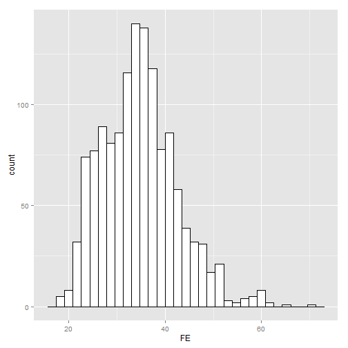

Application of Fuel Economy Analysis
========================================================
author: YuChou Chen
date: 2015-03-17
width: 1024
height: 900
transition: rotate
incremental: false
font-family: 'Helvetica'

- Course Project of devdataprod-012 (Developing Data Products)

Application of Fuel Economy Analysis
========================================================
type: exclaim
id: slide1

- Basic: Explortory Data Analysis
- Advanced: Fitting Method using Linear Method and Others
- Based on Shiny

For more details, <span style=color:red>welcome to visit</span>:
https://yuchouchen.shinyapps.io/ShinyProject/

Basic: Explortory Data Analysis
========================================================
type: exclaim


```r
summary(dataset$FE)
```

```
   Min. 1st Qu.  Median    Mean 3rd Qu.    Max. 
  17.50   29.00   34.50   34.71   39.23   69.64 
```

 

Advanced: Fitting Method
========================================================
type: exclaim

Fitting method can be :
- lm (linear model) 
- loess (local polynomial regression fitting)
- gam (generalized additive model)

 

Summary
========================================================
type: exclaim

- Easy to explore Fuel Economy data
- Quick to find relationship between key variables and Fuel Economy

- <span style=color:red>Why not give it a trial?</span> Just click: 
https://yuchouchen.shinyapps.io/ShinyProject/

[Go to slide 1](#/slide1)

